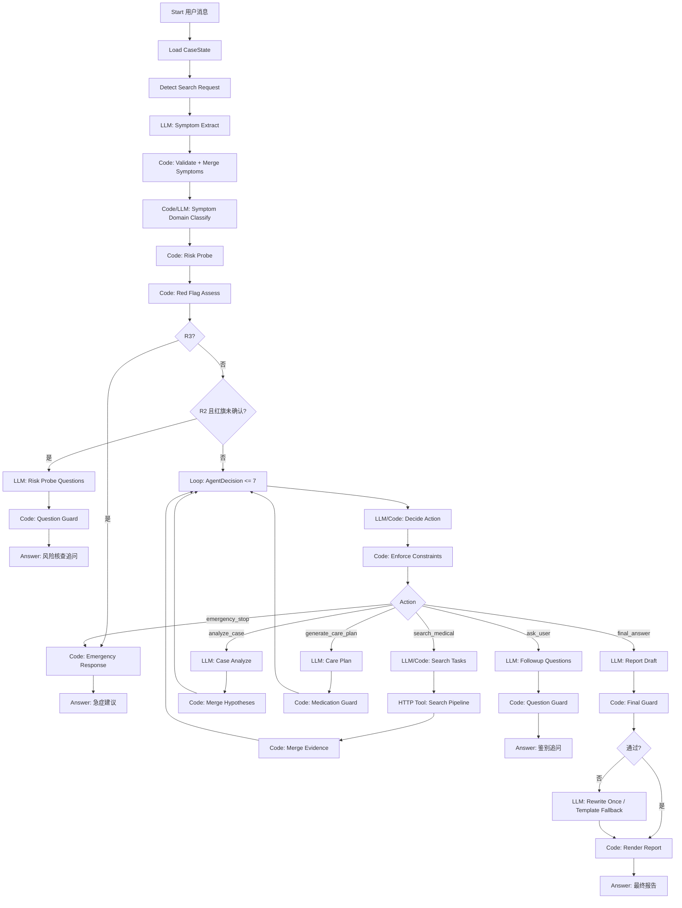

# 问康 CareCue Agent 迁移到 Dify Chatflow 的流程梳理

版本：v0.1  
日期：2026-06-13  
状态：迁移前逻辑梳理，不涉及代码实现。

## 1. 结论

问康 Agent 更适合迁移为 **Dify Chatflow**，不是普通 Workflow，也不建议一开始就做成完全开放的 Agent 节点。

如果要直接开始在 Dify 里搭第一版画布，先看配套手册：[问康 Agent 第一版 Dify Chatflow 搭建手册](DIFY_FIRST_CHATFLOW_BUILD_GUIDE.md)。

原因：

1. 问康是多轮健康咨询。每轮用户消息都要读取并更新同一个病例状态 `CaseState`，这正好对应 Chatflow 的对话触发和会话变量能力。
2. 当前代码核心是“固定安全前置流程 + 受约束的 AgentDecision 循环”，不是一次性批处理。普通 Workflow 更适合单次输入、单次输出的报告生成，不适合持续追问和续聊。
3. 医疗安全边界不能完全交给模型自由规划。Dify 可以可视化编排节点，但红旗规则、状态合并、用药边界、最终输出守卫仍应保留为代码节点、HTTP 服务或工具节点。

> 迁移目标不是把所有 TypeScript 代码逐行搬进 Dify，而是把当前 Agent 的“可解释执行顺序”拆成可视化节点，同时保留关键安全规则。

## 2. 当前问康 Agent 的真实运行入口

服务端入口在 `server/index.ts`：

1. `POST /api/agent/consult`
2. `POST /api/agent/consult/stream`

二者都会调用：

```text
createCareCueAgentRuntime(...)
  -> runCareCueAgent(input, deps)
```

运行时装配在 `server/agent/index.ts`：

```text
CaseStateService
MessageService
ToolRegistry
ToolExecutor
SearchPipeline
OpenRouter LLM Client
Firecrawl Search Client
```

真正的主流程在 `server/agent/agentLoop.ts`。

## 3. 当前 Agent 执行顺序流

### 3.1 单轮总览

```text
用户输入
  -> 加载或创建 CaseState
  -> 记录用户消息
  -> 判断用户是否显式要求联网
  -> 症状抽取 symptom.extract
  -> 症状域识别 symptom.domain_classify
  -> 风险核查 risk.probe
  -> 红旗规则评估 risk.red_flag_assess
  -> 若 R3：急症输出并终止
  -> 若 R2 且关键红旗未确认：生成风险核查追问并返回
  -> 进入 AgentDecision 主循环
      -> search_medical
      -> analyze_case
      -> generate_care_plan
      -> ask_user
      -> final_answer
      -> emergency_stop
  -> 返回追问、阶段报告、最终报告或急症建议
```

### 3.2 固定前置流程

这部分每轮用户输入都会先执行，不能跳过。

| 顺序 | 当前代码模块 | 作用 | Dify 中建议节点 |
| --- | --- | --- | --- |
| 1 | `CaseStateService.loadOrCreate` | 读取或创建病例工作区 | Start + HTTP/Code：加载状态 |
| 2 | `messageService.appendUserMessage` | 追加用户消息 | HTTP/Code：记录消息，或先只依赖 Dify 会话 |
| 3 | `detectSearchRequest` | 判断“联网查一下”等显式意图 | Code：设置 `userRequestedSearch` |
| 4 | `symptom.extract` | 从用户最新消息抽取症状、年龄、性别、否认信息等 | LLM：结构化输出 JSON |
| 5 | `caseStateService.merge` | 串行合并到 `CaseState` | Code/HTTP：状态合并 |
| 6 | `symptom.domain_classify` | 识别症状域，如胸痛、头痛、眼部不适 | Code 优先，LLM 兜底 |
| 7 | `risk.probe` | 加载该症状域必须确认的风险问题 | Code |
| 8 | `risk.red_flag_assess` | 执行红旗组合规则，输出 R0-R3 | Code |

### 3.3 风险前置分支

固定前置流程后有两个强制分支：

```text
如果 risk.level === R3
  -> emergencyResponder.respond
  -> emergencyOutputGuard
  -> Answer 急症输出
  -> 终止本轮

如果 risk.level === R2 且 unresolvedRedFlags 不为空 且 probeStatus = in_progress
  -> question.generate_risk_probe
  -> questionGuard.validate
  -> 记录 askedQuestions
  -> Answer 风险核查追问
  -> 等待用户下一轮补充
```

这两个分支应放在 Dify Chatflow 的 AgentDecision 循环之前。原因是医疗安全必须前置，不能让模型先自由决定是否搜索或输出报告。

### 3.4 AgentDecision 主循环

当前代码允许最多 `maxAgentSteps = 7` 步。每步先决策，再按 action 分支执行。

允许的 action 只有 6 个：

```text
search_medical
analyze_case
generate_care_plan
ask_user
final_answer
emergency_stop
```

决策来源：

1. 默认由 LLM 按 `agentDecisionSchema` 输出结构化决策。
2. LLM 不可用或输出非法时，走 `deterministicDecision`。
3. 所有决策都必须经过 `enforceConstraints` 修正。

关键约束：

| 约束 | 当前行为 |
| --- | --- |
| R3 | 强制 `emergency_stop` |
| 联网关闭 | `search_medical` 改为本地分析或输出 |
| 搜索超限 | 不再搜索，除非用户本轮显式要求 |
| 没有症状 | 不允许 `analyze_case`，改为追问 |
| 已有 evidence | 不重复搜索，除非用户本轮显式要求 |
| 没有 hypotheses | 不允许 `generate_care_plan` 或 `final_answer` |
| 追问超限 | 不再 `ask_user` |

## 4. Dify Chatflow 节点设计

### 4.1 推荐总体画布



### 4.2 Chatflow 变量设计

Dify 中建议使用“会话变量”保存病例工作区。不要只依赖 LLM 上下文记忆。

| 变量名 | 类型建议 | 来源 | 用途 |
| --- | --- | --- | --- |
| `case_id` | string | 首轮创建，后续沿用 | 对应当前 `CaseState.caseId` |
| `case_state` | object 或 JSON string | 状态服务/Code 节点 | 当前病例工作区 |
| `user_message` | string | Start | 当前用户消息 |
| `user_id` | string | 外部传入，可选 | 用户隔离 |
| `search_requested` | boolean | Code | 本轮是否显式要求联网 |
| `agent_steps` | number | Code/Loop | 防止无限循环 |
| `decision` | object | LLM/Code | 当前 AgentDecision |
| `tool_result` | object | Tool/HTTP | 当前工具输出 |
| `final_response` | object/string | Renderer | 最终给用户的内容 |

最小可行迁移可以先把 `case_state` 作为 JSON string 存在 Dify 会话变量中。更稳妥的做法是保留后端 `CaseStateService`，Dify 每轮通过 HTTP 节点读取和写回。

## 5. 各环节迁移方式

### 5.1 症状抽取

当前代码：`server/agent/symptoms/symptomExtractor.ts`

Dify 节点：

```text
LLM 节点：Symptom Extract
输出：结构化 JSON
后置 Code/HTTP 节点：校验输出并合并到 case_state
```

必须保留的字段：

```text
chiefComplaint
duration
location
severity
painQuality
onsetPattern
associatedSymptoms
negativeSymptoms
progression
age
sex
pregnancy
chronicDiseases
currentMedications
```

注意：抽取节点只做信息抽取，不做诊断、不建议用药。

### 5.2 症状域识别

当前代码：`server/agent/symptoms/symptomDomainClassifier.ts`

Dify 节点：

```text
Code 节点：触发词优先匹配
可选 LLM 节点：未命中时兜底分类
Code 节点：写回 symptomDomain
```

建议保留代码规则，因为它决定加载哪一组风险核查问题。如果完全交给 LLM，会增加红旗漏判或误判。

### 5.3 风险核查与红旗评估

当前代码：

```text
risk.probe
risk.red_flag_assess
redFlagRules
redFlagRuleEngine
specialGroupRules
```

Dify 节点：

```text
Code/HTTP 节点：Risk Probe
Code/HTTP 节点：Red Flag Assess
IF/ELSE：R3 分支
IF/ELSE：R2 未确认红旗分支
```

这部分不建议迁成纯 LLM 节点。红旗规则必须确定性执行。

### 5.4 风险核查追问

当前代码：`question.generate_risk_probe` + `questionGuard`

Dify 节点：

```text
LLM 节点：生成 1-3 个风险核查问题
Code/HTTP 节点：去重、限数、targetField 校验
Variable Assigner：记录 askedQuestions、followupRounds、status=waiting_user
Answer 节点：返回追问
```

注意：这是返回用户的终点节点。返回后本轮 Chatflow 结束，等待用户下一条消息重新触发 Chatflow。

### 5.5 AgentDecision

当前代码：`server/agent/decideAction.ts`

Dify 节点：

```text
Loop 节点：最多 7 次
LLM 节点：输出 action JSON
Code/HTTP 节点：enforceConstraints
IF/ELSE 或条件分支：按 action 路由
```

迁移时不要只依赖 Dify Agent 节点自动选工具。当前项目的安全核心是“模型可以建议 action，但代码负责改写非法 action”。

### 5.6 联网检索

当前代码：`SearchPipeline`

内部顺序：

```text
SearchTask normalize
-> Firecrawl search
-> sourceFilter
-> fetchSourcePage
-> extractEvidenceFromPage
-> evidenceValidator
-> evidenceAggregator
-> 写回 evidence/searchTrace
```

Dify 节点建议：

```text
LLM/Code 节点：生成 SearchTasks
HTTP Tool 节点：调用现有后端 search-pipeline 服务
Code 节点：处理失败分支与状态合并
```

不建议拆成多个 Dify 内置搜索/抓取节点，原因：

1. 来源白名单和可信度过滤在项目代码中已有规则。
2. 证据抽取必须只从 accepted sources 中抽取。
3. 检索失败后当前 Agent 会继续分析，并在报告中标注“未经联网核验”，这需要统一状态处理。

### 5.7 疑似方向分析

当前代码：`case.analyze`

Dify 节点：

```text
LLM 节点：Case Analyze
Code 节点：schema 校验、最多 3 个主要方向、必须有反对依据或不确定点
Variable Assigner：写回 hypotheses 和 missingInfo
```

输出不能是自由文本，必须是结构化 JSON。

### 5.8 处理建议生成

当前代码：`care_plan.generate` + `medicationBoundaryGuard`

Dify 节点：

```text
LLM 节点：Care Plan
Code/HTTP 节点：Medication Boundary Guard
IF/ELSE：通过、可修复降级、失败恢复
Variable Assigner：写回 carePlan
```

用药边界必须保留：

```text
禁止剂量/疗程
禁止自行停药加药
禁止处方化推荐
禁止疗效承诺
特殊人群必须提示先问医生或药师
必须包含就医升级条件
```

### 5.9 鉴别追问

当前代码：`question.generate` + `questionGuard`

Dify 节点：

```text
LLM 节点：Followup Questions
Code 节点：Question Guard
Variable Assigner：记录 askedQuestions、followupRounds、status=waiting_user
Answer 节点：返回追问
```

与风险核查追问不同，这里的问题服务于鉴别方向、处理建议或缺失信息，不应重复已问问题。

### 5.10 最终报告

当前代码：`report.generate` + `finalAnswerGuard` + `reportRenderer`

Dify 节点：

```text
LLM 节点：Report Draft
Code/HTTP 节点：Final Answer Guard
IF/ELSE：不通过时重写一次
Code/HTTP 节点：模板降级与渲染
Answer 节点：最终报告
```

最终报告必须经过守卫，不能直接把 LLM 输出给用户。

## 6. 建议的迁移阶段

### 阶段 1：可视化理解版

目标：让运行逻辑在 Dify 中可视化，便于理解。

做法：

1. Chatflow 中搭建完整节点骨架。
2. 复杂代码逻辑先通过 HTTP 节点调用现有后端。
3. Dify 负责展示流程、变量、分支、追问和最终回答。

这一阶段不追求完全脱离当前 Node.js 服务。

### 阶段 2：半移植版

目标：把部分轻量逻辑迁入 Dify Code 节点。

可迁入：

```text
detectSearchRequest
简单状态字段合并
部分 questionGuard
部分 final 文案渲染
```

仍建议留在后端：

```text
redFlagRules
redFlagRuleEngine
SearchPipeline
evidenceValidator
evidenceAggregator
medicationBoundaryGuard
finalAnswerGuard
CaseState 持久化
```

### 阶段 3：Dify 可运行版

目标：Dify Chatflow 可以独立承载用户咨询。

前提：

1. `CaseState` 的存储、读取、合并策略已经稳定。
2. Dify 节点中的每个 LLM 输出都有 JSON schema 或等价校验。
3. 红旗规则和安全 guard 以工具服务形式稳定暴露。
4. 已完成与现有 `test:agent` 等价的回归用例。

## 7. 迁移时必须考虑的问题

### 7.1 状态一致性

当前代码强调 `CaseState` 串行合并。Dify 节点之间如果多处分散写变量，容易出现状态覆盖。

建议：

```text
所有状态更新统一走 mergeCaseState 工具或 HTTP 服务。
不要让多个 LLM 节点直接拼接和覆盖完整 case_state。
```

### 7.2 多轮续聊

当前项目支持刷新恢复和历史续聊，依赖 PostgreSQL 中的 `chat_sessions.case_state`。

Dify 迁移时要决定：

1. 是否由 Dify 会话变量保存状态。
2. 是否继续由 CareCue 后端保存状态。
3. 前端如何把 `case_id` 传给 Dify。

推荐先保留 CareCue 后端作为状态源，Dify 只做编排层。

### 7.3 安全规则不可 Prompt 化

以下逻辑不能只写在 Prompt 里：

```text
R3 不自动降级
R2 在未确认红旗时优先追问
红旗组合规则
搜索轮次限制
追问去重和上限
来源白名单过滤
用药边界检查
最终报告安全复核
内部风险码不外泄
```

它们应该是 Code/HTTP 节点。

### 7.4 搜索不能自由化

当前项目的搜索不是普通 Web Search，而是权威来源受控检索。

必须保留：

```text
AI 只生成检索意图和医学关键词
系统拼接来源白名单
D 级来源只进 trace，不进 evidence
证据必须有 sourceTitle/sourceUrl/credibility
报告引用只能来自 evidence
```

### 7.5 Dify 节点数量和循环复杂度

当前主循环最多 7 步，且每步可能有多个子节点。Dify 单条路径有节点深度限制时，需要控制拆分粒度。

建议：

1. 第一版把复杂子流程封装成 HTTP 工具，例如 `risk-assess`、`search-pipeline`、`final-guard`。
2. Dify 画布只暴露关键阶段，不把每个 TypeScript 函数都拆成独立节点。
3. 先保证逻辑可读和可验证，再逐步细拆。

### 7.6 流式过程展示

当前 `/api/agent/consult/stream` 会下发：

```text
status
tool_step
extracted_facts
risk_check
agent_decision
search_query
search_result
final
```

Dify Chatflow 可以天然展示多轮回答，但如果还需要当前前端那种“分析过程时间线”，需要额外设计：

1. 在 Dify 中用中间 Answer 节点输出过程信息。
2. 或保留 CareCue 前端，从 Dify/后端事件流接收结构化步骤。
3. 或把 trace 存成调试变量，只在调试面板展示。

## 8. 最小可行 Chatflow 节点清单

第一版建议节点如下：

| 节点 | 类型 | 是否必须 | 说明 |
| --- | --- | --- | --- |
| Start | Start | 必须 | 接收用户消息、case_id、user_id |
| Load State | HTTP/Code | 必须 | 读取或创建 `CaseState` |
| Detect Search Intent | Code | 必须 | 设置 `userRequestedSearch` |
| Symptom Extract | LLM | 必须 | 结构化症状抽取 |
| Merge Symptoms | HTTP/Code | 必须 | 校验并合并状态 |
| Domain Classify | Code/LLM | 必须 | 症状域识别 |
| Risk Probe | HTTP/Code | 必须 | 风险核查 |
| Red Flag Assess | HTTP/Code | 必须 | 红旗组合规则 |
| R3 Branch | IF/ELSE | 必须 | 急症终止 |
| R2 Probe Branch | IF/ELSE | 必须 | 未确认红旗优先追问 |
| Risk Question Generate | LLM | 必须 | 风险核查追问 |
| Question Guard | HTTP/Code | 必须 | 追问校验 |
| Agent Loop | Loop | 必须 | 最多 7 步 |
| Decide Action | LLM/Code | 必须 | 输出 action |
| Enforce Constraints | HTTP/Code | 必须 | 修正非法 action |
| Search Pipeline | HTTP Tool | 建议必须 | 联网证据链路 |
| Case Analyze | LLM | 必须 | 疑似方向分析 |
| Care Plan Generate | LLM | 完整支持域必须 | 处理建议 |
| Medication Guard | HTTP/Code | 必须 | 用药边界 |
| Followup Generate | LLM | 必须 | 鉴别追问 |
| Report Generate | LLM | 必须 | 报告草稿 |
| Final Guard | HTTP/Code | 必须 | 最终复核 |
| Renderer | HTTP/Code/Template | 必须 | 用户可见内容 |
| Answer | Answer | 必须 | 返回追问/报告/急症建议 |

## 9. 第一版迁移边界建议

第一版不要追求“完全无后端”。建议边界：

```text
Dify 负责：
- 可视化 Chatflow
- LLM 节点编排
- 条件分支
- 循环结构
- 用户可见回答

CareCue 后端负责：
- CaseState 读取、合并、持久化
- 红旗规则
- 搜索管线
- 证据过滤和聚合
- 用药边界 guard
- final guard
- trace/debug
```

这样做的好处是：迁移过程可控，安全逻辑不丢，Dify 能马上帮助理解运行逻辑。

## 10. 迁移验收标准

迁移后的 Chatflow 至少要能复现当前测试中的关键路径：

1. 胸痛但信息不足：进入 R2 风险核查追问，不直接 R3，不搜索。
2. 胸痛明确高危：进入 R3 急症输出，不继续普通分析，不搜索。
3. 熬夜后短暂头胀：R0/R1，能搜索或输出报告，提醒升级信号。
4. 眼睛胀痛无视力下降：输出视疲劳/干眼方向和人工泪液成分边界。
5. 眼痛伴视力下降：R3，建议尽快眼科急诊或急诊。
6. 面部长痘：R0/R1，不急诊化，能进入痤疮等方向。
7. 搜索无结果：不空输出，继续分析并标注未经联网核验。
8. 来源全部被过滤：D 级来源不进 evidence，不编造引用。
9. 重复消息：同一 case 连续相同输入不重复跑完整链路。
10. 用户可见输出不泄漏 `R0-R3` 内部码。

## 11. 当前梳理后的关键判断

问康 Agent 的核心不是“医疗 Prompt”，而是下面这条受控链路：

```text
CaseState
-> 症状结构化
-> 症状域识别
-> 风险核查
-> 红旗组合规则
-> 受约束的 AgentDecision
-> 权威证据管线
-> 疑似方向分析
-> 处理建议
-> 安全复核
-> 可渲染报告
```

迁移到 Dify 时，最容易犯的错误是把它简化成：

```text
用户输入 -> 大 Prompt -> 最终回答
```

这样会丢掉当前项目最重要的安全和可解释性。

正确迁移方向是：

```text
用 Dify Chatflow 可视化主流程；
用 Code/HTTP 节点保留确定性医学安全边界；
用 LLM 节点承担结构化理解、分析、追问和报告草稿；
用统一 CaseState 贯穿多轮对话。
```

## 12. 参考依据

1. Dify 官方文档：Workflow 和 Chatflow 都基于可视化节点系统；Workflow 更偏单次运行，Chatflow 增加对话层，每条用户消息都会触发流程，适合交互式助手和引导式问答。  
   https://docs.dify.ai/en/use-dify/build/workflow-chatflow
2. Dify 官方文档：Chatflow 是一种特殊的 workflow app，支持会话级变量、LLM 节点记忆，以及在 Chatflow 运行过程中流式输出格式化内容。  
   https://docs.dify.ai/en/use-dify/getting-started/key-concepts
3. Dify 官方文档：Workflow/Chatflow 支持串行、并行、Iteration 和 Loop 编排；单条执行路径有节点数量限制，自托管可通过环境变量调整。  
   https://docs.dify.ai/en/use-dify/build/orchestrate-node
