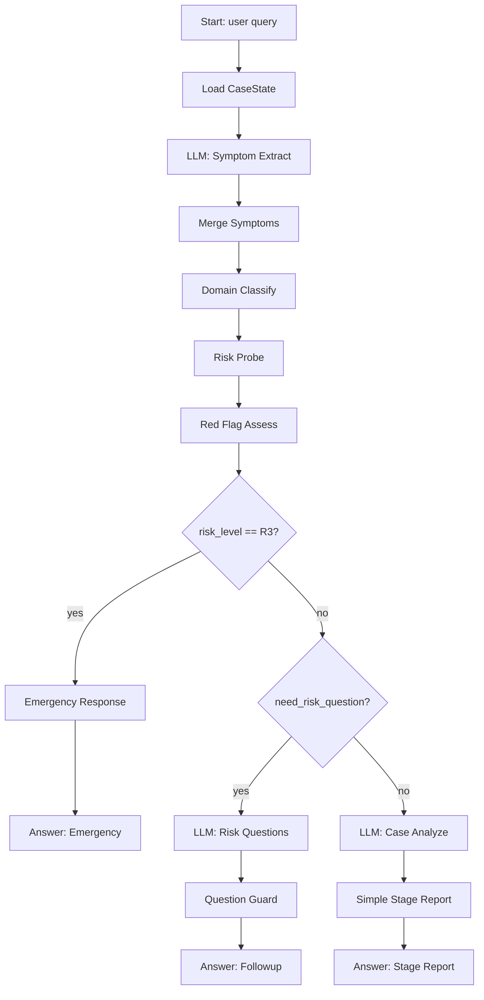

# 问康 Agent 第一版 Dify Chatflow 搭建手册

版本：v0.1  
日期：2026-06-13  
目标：解决“我打开 Dify 以后不知道怎么把问康 Agent 流程搭成节点”的问题。

## 1. 第一版不要一口气搭完整 Agent

当前问康 Agent 代码已经是一个较完整的医疗安全工作流。如果第一版在 Dify 里直接复刻所有细节，会遇到三个问题：

1. 画布会很复杂，节点太多，很难调试。
2. 红旗规则、状态合并、搜索证据管线、用药边界这些逻辑不适合靠 Prompt 硬搬。
3. 你真正的目标是先“看懂运行逻辑”，不是马上替换生产后端。

所以第一版建议分三层搭：

```text
第 1 层：搭主干，看懂一轮咨询怎么走。
第 2 层：搭风险分支，看懂 R3 急症 / R2 追问 / 普通分析怎么分流。
第 3 层：搭 AgentDecision 循环，看懂搜索、分析、建议、报告如何推进。
```

## 2. 第一版推荐形态

使用 Dify **Chatflow**。

第一版画布不要用 Dify Agent 节点作为核心。原因是问康的核心不是“让模型自由选工具”，而是：

```text
模型输出结构化建议
代码检查是否合法
不合法就修正或降级
```

因此第一版节点类型主要用：

| Dify 节点 | 用途 |
| --- | --- |
| Start / User Input | 接收用户最新消息 |
| LLM | 症状抽取、决策、追问、报告草稿 |
| Code | 简单规则、变量整理、状态补丁、分支前判断 |
| HTTP Request | 调用现有 CareCue 后端封装出来的规则/搜索/安全服务 |
| If-Else | R3 / R2 / action 分支 |
| Loop | AgentDecision 最多循环 7 步 |
| Variable Assigner | 保存会话变量，如 `case_state` |
| Answer | 返回追问、急症建议、最终报告 |

## 3. 先定一个最小可跑版本

第一版不要从完整主循环开始。先搭这个：

```text
用户输入
-> 加载 case_state
-> 症状抽取
-> 症状域识别
-> 风险评估
-> IF R3：急症输出
-> ELSE IF R2 且需要追问：风险追问
-> ELSE：生成阶段性报告
```

这个版本先不做：

```text
AgentDecision Loop
联网搜索
证据抽取
carePlan
finalAnswerGuard 重写
历史记录完整还原
```

这样能先把最核心的“前置安全流程”可视化出来。

## 4. Dify 会话变量怎么建

进入 Dify 创建 Chatflow 后，先定义这些变量。变量名不要中文。

| 变量名 | 类型 | 初始值 | 说明 |
| --- | --- | --- | --- |
| `case_id` | string | 空 | 当前病例 ID |
| `case_state` | object 或 string | `{}` | 当前病例工作区。Dify 不好处理 object 时先用 JSON string |
| `risk_level` | string | `R0` | 内部风险级别，只用于分支，不直接展示给用户 |
| `need_risk_question` | boolean | `false` | 是否需要先问危险信号 |
| `final_text` | string | 空 | 最终 Answer 使用的文本 |
| `debug_trace` | array 或 string | 空 | 第一版调试用，可选 |

建议：

1. 如果你只是搭原型，`case_state` 可以先存在 Dify 会话变量里。
2. 如果你要和当前项目联动，`case_state` 应该继续由 CareCue 后端保存，Dify 只保存 `case_id`。

## 5. 第一层画布：安全前置主干

### 5.1 节点 1：Start

用途：接收用户最新输入。

关键输入：

```text
query：用户最新消息
case_id：可选，已有会话时由前端传入
user_id：可选，如果要接入登录用户
```

在 Chatflow 里，用户最新消息通常可以用内置 query 变量。

### 5.2 节点 2：Load CaseState

类型：HTTP Request 或 Code

第一版有两个选择：

| 方式 | 适合情况 | 做法 |
| --- | --- | --- |
| Code 伪状态 | 只是学习 Dify 画布 | 如果没有 `case_state`，创建一个最小 JSON |
| HTTP 后端状态 | 准备后续真实迁移 | 调 CareCue 后端读取或创建 `CaseState` |

第一版建议先用 HTTP，但需要后端之后补一个接口，例如：

```text
POST /api/dify/case/load
```

请求体：

```json
{
  "caseId": "{{case_id}}",
  "userId": "{{user_id}}"
}
```

返回：

```json
{
  "caseId": "...",
  "caseState": {}
}
```

### 5.3 节点 3：Symptom Extract

类型：LLM

作用：只抽取信息，不诊断。

输入：

```text
用户最新消息：{{query}}
当前病例状态：{{case_state}}
```

输出变量建议命名：

```text
symptom_extract
```

输出必须是 JSON，例如：

```json
{
  "chiefComplaint": "",
  "duration": "",
  "location": "",
  "severity": "",
  "painQuality": "",
  "associatedSymptoms": [],
  "negativeSymptoms": [],
  "progression": "unknown",
  "age": null,
  "sex": "unknown",
  "pregnancy": null,
  "chronicDiseases": [],
  "currentMedications": []
}
```

Prompt 重点：

```text
你只做症状信息抽取。
不要诊断。
不要建议用药。
不要安慰或判断严重程度。
只输出 JSON。
```

### 5.4 节点 4：Merge Symptoms

类型：HTTP Request 或 Code

作用：把 `symptom_extract` 合并进 `case_state`。

如果是 Dify 原型，可以先用 Code 简化合并。  
如果要贴近当前项目，应该 HTTP 调用后端：

```text
POST /api/dify/case/merge
```

请求体：

```json
{
  "caseId": "{{case_id}}",
  "patch": {
    "symptoms": "{{symptom_extract}}"
  },
  "source": "llm",
  "updateReason": "symptom_extracted"
}
```

返回：

```json
{
  "caseState": {},
  "changedFields": []
}
```

然后用 Variable Assigner 把返回的 `caseState` 写回 `case_state`。

### 5.5 节点 5：Domain Classify

类型：HTTP Request 优先，Code 次选，LLM 兜底

作用：识别症状域：

```text
chest_pain
headache
eye_discomfort
skin_mild
gastrointestinal
throat_respiratory
general_discomfort
unknown
```

第一版建议用 HTTP 调当前项目规则，后端之后可封装：

```text
POST /api/dify/agent/domain-classify
```

请求：

```json
{
  "caseState": "{{case_state}}"
}
```

返回：

```json
{
  "caseState": {},
  "primaryDomain": "eye_discomfort"
}
```

### 5.6 节点 6：Risk Probe

类型：HTTP Request

作用：根据症状域加载风险核查问题，判断还有哪些危险信号没确认。

建议封装后端接口：

```text
POST /api/dify/agent/risk-probe
```

返回关键字段：

```json
{
  "caseState": {},
  "riskProbe": {
    "probeStatus": "in_progress",
    "unresolvedRedFlags": [],
    "requiredQuestions": []
  }
}
```

### 5.7 节点 7：Red Flag Assess

类型：HTTP Request

作用：执行红旗组合规则。

建议封装后端接口：

```text
POST /api/dify/agent/risk-assess
```

返回：

```json
{
  "caseState": {},
  "riskLevel": "R2",
  "needRiskQuestion": true,
  "riskReason": "..."
}
```

用 Variable Assigner 写入：

```text
risk_level = riskLevel
need_risk_question = needRiskQuestion
case_state = caseState
```

## 6. 第二层画布：风险分支

### 6.1 节点 8：If R3

类型：If-Else

条件：

```text
risk_level == "R3"
```

R3 分支走急症输出。  
非 R3 进入下一层判断。

### 6.2 节点 9：Emergency Response

类型：HTTP Request 或 Code

建议直接用后端生成，避免 Dify LLM 临场发挥。

```text
POST /api/dify/agent/emergency-response
```

请求：

```json
{
  "caseState": "{{case_state}}"
}
```

返回：

```json
{
  "content": "..."
}
```

后接 Answer 节点，输出：

```text
{{content}}
```

这一条分支到此结束，不继续分析、不搜索。

### 6.3 节点 10：If Need Risk Question

类型：If-Else

条件：

```text
risk_level == "R2" AND need_risk_question == true
```

成立：生成风险核查追问。  
不成立：进入普通分析。

### 6.4 节点 11：Risk Question Generate

类型：LLM

输入：

```text
case_state
riskProbe.requiredQuestions
```

输出 JSON：

```json
{
  "intro": "",
  "questions": [
    {
      "question": "",
      "reason": "",
      "targetField": "symptoms.duration",
      "priority": "high",
      "type": "risk_probe"
    }
  ]
}
```

### 6.5 节点 12：Question Guard

类型：HTTP Request

建议封装：

```text
POST /api/dify/agent/question-guard
```

作用：

```text
去重
限数
检查 targetField
过滤已回答字段
记录 askedQuestions
更新 status=waiting_user
```

返回：

```json
{
  "caseState": {},
  "renderedQuestion": "..."
}
```

后接 Answer：

```text
{{renderedQuestion}}
```

这一条分支到此结束，等待用户下一轮回答。

## 7. 第三层画布：普通分析的最小版本

第一版普通分析不要先做完整 Agent Loop。先用一个简化链路：

```text
Case Analyze
-> Simple Stage Report
-> Answer
```

### 7.1 节点 13：Case Analyze

类型：LLM

输入：

```text
case_state
```

输出 JSON：

```json
{
  "hypotheses": [
    {
      "name": "",
      "likelihood": "possible",
      "supportEvidence": [],
      "againstEvidence": [],
      "missingInfo": [],
      "riskLevel": "low",
      "doctorCheckQuestion": "",
      "explanationForUser": ""
    }
  ],
  "missingInfo": [],
  "stageConclusion": "",
  "canFinalAnswer": false,
  "shouldAskUser": false,
  "shouldSearchMore": false,
  "shouldGenerateCarePlan": false
}
```

### 7.2 节点 14：Merge Analysis

类型：HTTP Request 或 Code

写回：

```text
hypotheses
missingInfo
```

### 7.3 节点 15：Simple Stage Report

类型：LLM 或 HTTP

第一版可以先用 LLM 生成阶段性说明，但要限制结构：

```text
1. 当前整理到的信息
2. 当前风险边界
3. 可能方向，不超过 3 个
4. 仍不确定的点
5. 下一步建议
6. 何时必须就医
7. 给医生看的摘要
```

更稳妥的方式是调后端模板渲染：

```text
POST /api/dify/agent/stage-report
```

### 7.4 节点 16：Answer Stage Report

类型：Answer

输出：

```text
{{stage_report_text}}
```

## 8. 第四层：再加入 AgentDecision Loop

等前面 16 个节点跑通后，再加 Loop。

Loop 内部最小结构：

```text
Decide Action
-> Enforce Constraints
-> If action
```

### 8.1 Loop 设置

Loop 最大次数：

```text
7
```

Loop 变量：

| 变量 | 初始值 | 说明 |
| --- | --- | --- |
| `loop_case_state` | `case_state` | 每轮更新后的状态 |
| `loop_action` | 空 | 当前 action |
| `loop_done` | false | 是否退出循环 |
| `loop_response_type` | 空 | followup/final/emergency/stage |
| `loop_response_text` | 空 | 循环最终输出 |

终止条件：

```text
loop_done == true
```

### 8.2 Decide Action 节点

类型：LLM

输出 JSON：

```json
{
  "action": "analyze_case",
  "reason": "",
  "decisionGoal": "",
  "confidence": "medium",
  "priority": "high",
  "shouldReturnToUser": false,
  "searchTasks": []
}
```

允许 action：

```text
search_medical
analyze_case
generate_care_plan
ask_user
final_answer
emergency_stop
```

### 8.3 Enforce Constraints 节点

类型：HTTP Request

建议封装当前 `decideAction.enforceConstraints`：

```text
POST /api/dify/agent/enforce-decision
```

输入：

```json
{
  "caseState": "{{loop_case_state}}",
  "decision": "{{decision}}"
}
```

输出：

```json
{
  "decision": {
    "action": "search_medical",
    "reason": "..."
  }
}
```

### 8.4 Action 分支

用 If-Else 或多个条件分支：

| action | 节点链 |
| --- | --- |
| `search_medical` | Search Pipeline -> Merge Evidence -> 回到 Loop |
| `analyze_case` | Case Analyze -> Merge Analysis -> 回到 Loop |
| `generate_care_plan` | Care Plan -> Medication Guard -> Merge CarePlan -> 回到 Loop |
| `ask_user` | Followup Generate -> Question Guard -> `loop_done=true` |
| `final_answer` | Report Generate -> Final Guard -> Renderer -> `loop_done=true` |
| `emergency_stop` | Emergency Response -> `loop_done=true` |

## 9. 第一版后端 HTTP 包装建议

如果要让 Dify 真正复用当前项目，建议后端后续补一组“Dify 专用薄接口”。它们不改变现有 Agent 逻辑，只是把内部函数暴露给 Dify 节点。

| 接口 | 对应当前模块 | 给 Dify 的价值 |
| --- | --- | --- |
| `/api/dify/case/load` | `CaseStateService.loadOrCreate` | 读/建状态 |
| `/api/dify/case/merge` | `CaseStateService.merge` | 统一状态合并 |
| `/api/dify/agent/domain-classify` | `symptom.domain_classify` | 规则优先识别症状域 |
| `/api/dify/agent/risk-probe` | `risk.probe` | 风险核查 |
| `/api/dify/agent/risk-assess` | `risk.red_flag_assess` | 红旗组合评估 |
| `/api/dify/agent/question-guard` | `questionGuard` | 追问去重/限数 |
| `/api/dify/agent/enforce-decision` | `enforceConstraints` | 修正非法 action |
| `/api/dify/agent/search-pipeline` | `SearchPipeline` | 权威检索和证据抽取 |
| `/api/dify/agent/medication-guard` | `medicationBoundaryGuard` | 用药边界复核 |
| `/api/dify/agent/final-guard` | `finalAnswerGuard` | 最终报告安全复核 |
| `/api/dify/agent/render` | `reportRenderer` | 渲染用户可见内容 |

这些接口是“迁移支架”，不是新业务逻辑。Dify 负责可视化，后端负责安全。

## 10. 你在 Dify 里实际怎么开始

按这个顺序做，不要跳步：

1. 新建 App，类型选 Chatflow。
2. 先建会话变量：`case_id`、`case_state`、`risk_level`、`need_risk_question`、`final_text`。
3. 放 Start 节点。
4. 放 Load CaseState 节点。没有后端接口时先用 Code 创建最小状态。
5. 放 Symptom Extract LLM 节点，先确保它能稳定输出 JSON。
6. 放 Merge Symptoms 节点，把 JSON 写进 `case_state`。
7. 放 Domain Classify 节点。
8. 放 Risk Probe 节点。
9. 放 Red Flag Assess 节点。
10. 放 If R3 分支，接 Emergency Response 和 Answer。
11. 放 If Need Risk Question 分支，接 Risk Question Generate、Question Guard 和 Answer。
12. 普通分支先接 Case Analyze、Stage Report 和 Answer。
13. 用 3 条测试输入跑通：
    - `胸口压榨性疼痛持续20分钟，出冷汗，有点喘不上气。`
    - `最近胸口有点疼，有时候左胳膊针痛，经常熬夜，24岁。`
    - `最近看电脑很多，眼睛有点胀，双眼都有，没有视力下降，没有红眼。`
14. 三条都能走到正确分支后，再加 AgentDecision Loop。

## 11. 第一版画布长什么样

第一版先搭成这样就够：



这个图就是你的第一版 Dify 搭建目标。

## 12. 判断是否搭对了

用下面结果判断：

### 输入 1

```text
胸口压榨性疼痛持续20分钟，左臂也疼，出冷汗，有点喘不上气。
```

期望：

```text
走 R3 分支
直接输出急症建议
不进入普通分析
不搜索
```

### 输入 2

```text
最近胸口有点疼，有时候左胳膊也有针痛感，经常熬夜，24岁。
```

期望：

```text
走 R2 风险核查追问
追问持续时间、疼痛性质、伴随症状等
不直接急症化
不归因熬夜
```

### 输入 3

```text
最近看电脑很多，眼睛有点胀，双眼都有，没有视力下降，没有红眼。
```

期望：

```text
不走急症
进入普通分析
可能方向包括视疲劳、干眼等
提醒出现视力下降、剧痛、明显红眼时就医
```

## 13. 常见卡点

### 13.1 不知道哪些用 LLM，哪些用 Code/HTTP

判断规则：

```text
需要理解自然语言 -> LLM
需要稳定规则和安全边界 -> Code/HTTP
需要保存状态 -> Variable Assigner 或 HTTP
需要分流 -> If-Else
需要多步推进 -> Loop
需要返回用户 -> Answer
```

### 13.2 case_state 在 Dify 里太大

第一版只保留最小状态：

```text
caseId
symptoms
symptomDomain
risk
riskProbe
hypotheses
missingInfo
askedQuestions
meta
```

联网证据、完整 trace、历史消息可以先留在后端。

### 13.3 LLM 节点 JSON 不稳定

解决方式：

1. Prompt 明确“只输出 JSON，不要 Markdown”。
2. 后面加 Code 节点做 JSON parse。
3. parse 失败走阶段性降级 Answer。
4. 生产版用后端 Zod 校验，不要只信 Dify LLM 输出。

### 13.4 不知道什么时候加 Loop

先不要加。  
当你已经能稳定跑通：

```text
R3 急症
R2 风险追问
普通阶段报告
```

再加 Loop。

### 13.5 Dify Answer 节点放哪里

Answer 是 Chatflow 的用户输出节点。第一版有三个 Answer：

```text
Emergency Answer
Risk Followup Answer
Stage Report Answer
```

不要所有分支都汇总到一个 Answer，第一版先分开，更容易调试。

## 14. 下一步工作建议

下一步应该先做两件事：

1. 在 Dify 里按第 11 节搭出第一版画布。
2. 在当前项目后端补最小 Dify HTTP 包装接口，让 Dify 节点能调用真实规则。

等第一版画布能跑通三条测试输入后，再把 `Stage Report` 分支升级成完整的：

```text
AgentDecision Loop
-> SearchPipeline
-> CaseAnalyze
-> CarePlan
-> FinalReport
-> FinalGuard
```

## 15. 参考依据

1. Dify Answer 节点用于 Chatflow 中返回用户内容，Workflow 使用 Output 节点。  
   https://docs.dify.ai/en/use-dify/nodes/answer
2. Dify Variable Assigner 用于写入会话变量；会话变量会在同一聊天会话中跨轮持久。  
   https://docs.dify.ai/en/use-dify/nodes/variable-assigner
3. Dify HTTP Request 节点可以连接外部 API，支持变量替换和 JSON 请求。  
   https://docs.dify.ai/en/use-dify/nodes/http-request
4. Dify Code 节点可运行 Python 或 JavaScript，用于数据转换和逻辑处理。  
   https://docs.dify.ai/en/use-dify/nodes/code
5. Dify If-Else 节点用于按条件分支。  
   https://docs.dify.ai/en/use-dify/nodes/ifelse
6. Dify Loop 节点用于带状态的重复执行，并支持最大循环次数和终止条件。  
   https://docs.dify.ai/en/use-dify/nodes/loop
